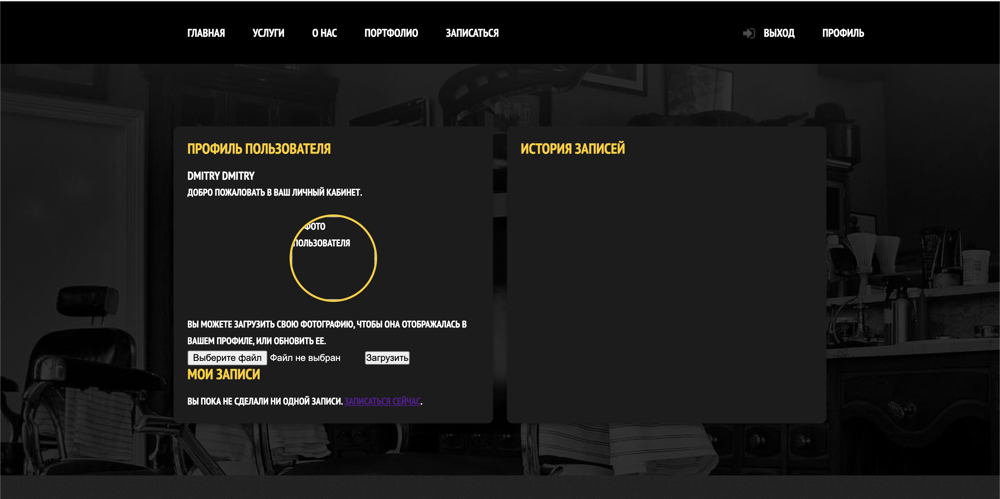
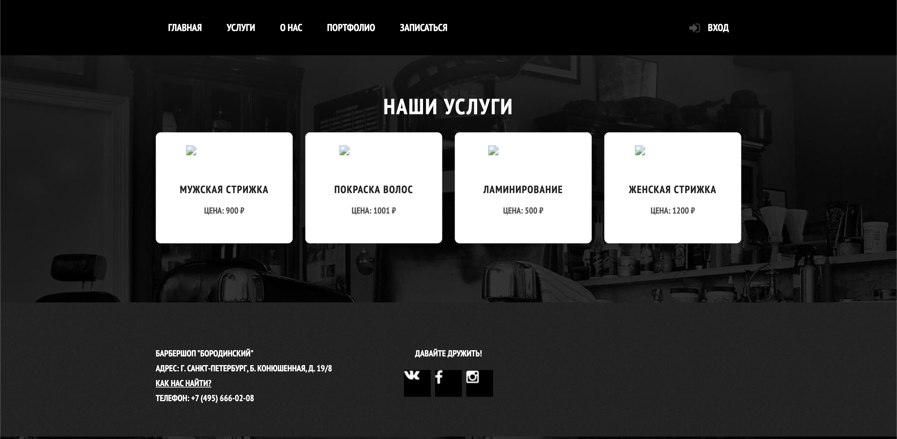
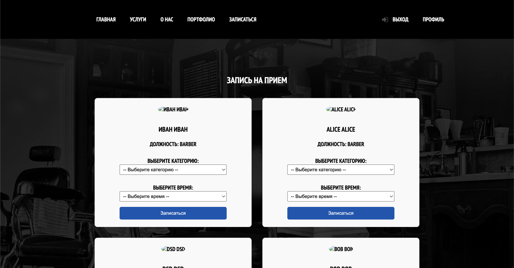

# Barbershop Web Application

 <!-- Замените на реальный путь к логотипу -->

Веб-приложение для управления барбершопом, разработанное на Java с использованием Jakarta EE и Apache Tomcat.

## 🚀 Технологический стек

- **Backend**: Jakarta Servlet, JSP
- **Frontend**: HTML5, CSS3, JavaScript, JSTL
- **База данных**: JDBC (поддерживается PostgreSQL)
- **Сервер приложений**: Apache Tomcat 10+
- **Сборка**: Maven
- **Шаблонизация**: JSP + JSTL

## 📦 Установка и запуск

### Требования
- JDK 11+
- Apache Tomcat 10+
- Maven 3.8+
- База данных (PostgreSQL 12+)

### Установка
1. Клонируйте репозиторий:
```bash
git clone https://github.com/RybakovDmitry2072/crazyBarberShop.git
cd crazyBarberShop
```

2. Настройте базу данных:
- Создайте БД `barbershop_db`
- Настройте подключение в `src/main/resources/db.properties`

3. Соберите проект:
```bash
mvn clean package
```

4. Разверните на Tomcat:
- Скопируйте `target/barbershop.war` в директорию `webapps` вашего Tomcat
- Или используйте менеджер приложений Tomcat

5. Запустите Tomcat и откройте:
```
http://localhost:8080/
```

## 🛠 Функционал
- Регистрация и авторизация клиентов
- Запись на прием к барберу
- Управление барберами (для администраторов)
- Управление клиентами (для администраторов)
- Просмотр расписания
- История посещений
- Управление услугами и ценами
- Админ панель для управления заказами, категориями стрижек, временных слотов для оказания услуг

## 🗃 Структура БД
Основные таблицы:
- `users` - клиенты и администраторы
- `employees` - информация о барберах
- `categories` - категории стрижек
- `appointments` - записи на прием
- `time_slots` - график работы барберов

## 📸 Скриншоты







## 📌 Важно
- Для работы с БД используется чистый JDBC
- Конфигурация подключения к БД в  `src/main/resources/db.`
- Все SQL-запросы вынесены в отдельную папку `repositories`

## 🤝 Контакты

Разработчик: Дмитрий Рыбаков 
Email: yroboros2020@mail.ru

GitHub: [@https://github.com/RybakovDmitry2072](https://github.com/RybakovDmitry2072)
